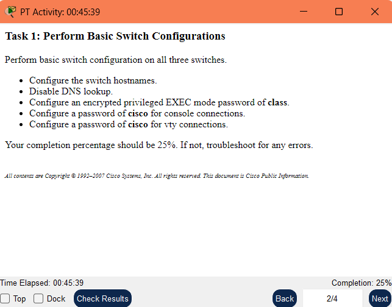
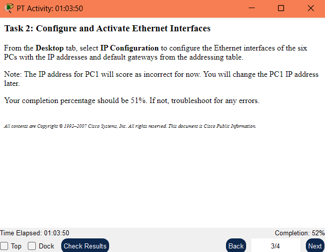
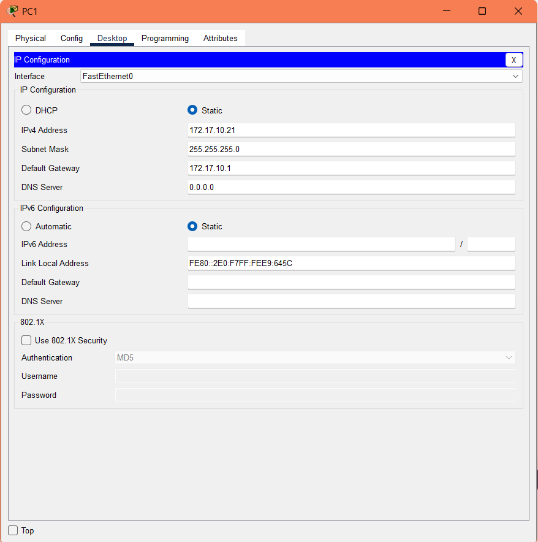
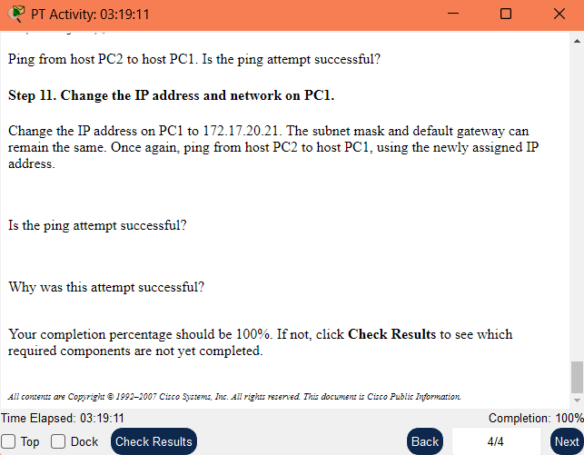

# Basic VLAN Configuration

**NOTE TO USER: This activity is a variation of Lab 3.5.1. Packet Tracer may not support all the tasks specified in the hands-on lab. This activity should not be considered equivalent to completing the hands-on lab. Packet Tracer is not a substitute for a hands-on lab experience with real equipment.**

## Addressing Table

|Device||Interface||IP Address|	    |Subnet Mask|	    |Default Gateway|
---------------------------------------------------------------------------------
|S1     |VLAN 99|172.17.99.11|255.255.255.0|N/A
|S2     |VLAN 99|172.17.99.12|255.255.255.0|N/A
|S3     |VLAN 99|172.17.99.13|255.255.255.0|N/A
|PC1        |NIC    |172.17.10.21|255.255.255.0|172.17.10.1
|PC2        |NIC    |172.17.20.22|255.255.255.0|172.17.20.1
|PC3        |NIC    |172.17.30.23|255.255.255.0|172.17.30.1
|PC4        |NIC    |172.17.10.24|255.255.255.0|172.17.10.1
|PC5        |NIC    |172.17.20.25|255.255.255.0|172.17.20.1
|PC6        |NIC    |172.17.30.26|255.255.255.0|172.17.30.1

## Port Assignments (Switches 2 and 3)

|Ports|            |Assignment|                 |Network|
---------------------------------------------------------------------
|Fa0/1-0/5    |VLAN 99 - Management&Native  |172.17.99.0 /24
|Fa0/6-0/10    |VLAN 30 - Guest(Default)  |172.17.30.0 /24
|Fa0/11 - 0/17|VLAN 10 - Faculty/Staff      |172.17.10.0 /24
|Fa0/18 - 0/24|VLAN 20 - Students          |172.17.20.0 /24

## Learning Objectives

  -*Perform basic configuration tasks on a switch.*
  -*Create VLANs.*
  -*Assign switch ports to a VLAN.*
  -*Add, move, and change ports.*
  -*Verify VLAN configuration.*
  -*Enable trunking on inter-switch connections.*
  -*Verify trunk configuration.*
  -*Save the VLAN configuration.*

## Task 1: Perform Basic Switch Configurations

### Perform basic switch configuration on all three switches

-Configure the switch hostnames.
-Disable DNS lookup.
-Configure an encrypted privileged EXEC mode password of class.
-Configure a password of cisco for console connections.
-Configure a password of cisco for vty connections.

**Your completion percentage should be 25%. If not, troubleshoot for any errors.**


```bash
Switch>enable
Switch#configure terminal
Enter configuration commands, one per line.  End with CNTL/Z.
Switch(config) hostname S1
```

```bash
S1(config)no ip domain-lookup
```

```bash
S1(config) enable secret class
```

```bash
S1(config) line console 0
S1(config-line) password cisco
S1(config-line) login
```

```bash
S1(config-line) line vty 0 15
S1(config-line) password cisco
S1(config-line) login
```

```bash
S1(config-line) end
%SYS-5-CONFIG_I: Configured from console by console
```

```bash
S1 write memory
Building configuration...
[OK]
```

**Estos pasos están en orden de acuerdo a lo solicitado, los últimos 2 comandos es para guardar la configuración, además, se debe repetir para cada uno de los switches.**

## Task 2: Configure and Activate Ethernet Interfaces

From the Desktop tab, select IP Configuration to configure the Ethernet interfaces of the six PCs with the IP addresses and default gateways from the addressing table.

**Note: The IP address for PC1 will score as incorrect for now. You will change the PC1 IP address later.**

**Your completion percentage should be 51%. If not, troubleshoot for any errors.**


## Task 3: Configure VLANs on the Switch

### Step 1. Create VLANs on switch S1

Use the vlan vlan-id command in global configuration mode to add VLANs to switch S1. There are four VLANs to configure for this activity. After you create the VLAN, you will be in vlan configuration mode, where you can assign a name to the VLAN with the vlan name command.

### Step 2. Verify that the VLANs have been created on S1

Use the show vlan brief command to verify that the VLANs have been created.

```bash
S1#show vlan brief

VLAN Name                             Status    Ports
---- -------------------------------- --------- -------------------------------
1    default                          active    Fa0/1, Fa0/2, Fa0/4, Fa0/5
                                                Fa0/6, Fa0/7, Fa0/8, Fa0/9
                                                Fa0/10, Fa0/11, Fa0/12, Fa0/13
                                                Fa0/14, Fa0/15, Fa0/16, Fa0/17
                                                Fa0/18, Fa0/19, Fa0/20, Fa0/21
                                                Fa0/22, Fa0/23, Fa0/24, Gi0/1
                                                Gi0/2
10   Faculty/Staff                    active
20   Students                         active
30   Guest(Default)                   active
99   Management&Native                active 
```

### Step 3. Configure and name VLANs on switches S2 and S3

Create and name VLANs 10, 20, 30, and 99 on S2 and S3 using the commands from Step 1. Verify the correct configuration with the show vlan brief command.

```bash
User Access Verification

Password: 

S1>enable
Password: 
S1#configure terminal
Enter configuration commands, one per line.  End with CNTL/Z.
S1(config) vlan 99
S1(config-vlan) name Management&Native
S1(config-vlan) exit
S1(config) vlan 10
S1(config-vlan) name Faculty/Staff
S1(config-vlan) exit
S1(config) vlan 20
S1(config-vlan) name Students
S1(config-vlan) exit
S1(config) vlan 30
S1(config-vlan) name Guest(Default)
S1(config-vlan) exit
S1(config) exit
S1#
%SYS-5-CONFIG_I: Configured from console by console

S1#show vlan brief

VLAN Name                             Status    Ports
---- -------------------------------- --------- -------------------------------
1    default                          active    Fa0/1, Fa0/2, Fa0/3, Fa0/4
                                                Fa0/5, Fa0/6, Fa0/7, Fa0/8
                                                Fa0/9, Fa0/10, Fa0/11, Fa0/12
                                                Fa0/13, Fa0/14, Fa0/15, Fa0/16
                                                Fa0/17, Fa0/18, Fa0/19, Fa0/20
                                                Fa0/21, Fa0/22, Fa0/23, Fa0/24
                                                Gig0/1, Gig0/2
10   Faculty/Staff                    active    
20   Students                         active    
30   Guest(Default)                   active    
99   Management&Native                active    
1002 fddi-default                     active    
1003 token-ring-default               active    
1004 fddinet-default                  active    
1005 trnet-default                    active  

S1#end
Translating "end"
% Unknown command or computer name, or unable to find computer address

S1#write memory
Building configuration...
[OK]
```

What ports are currently assigned to the four VLANs you have created?

**R/ Ningún puerto está asignado a ninguna VLAN.**

**Repetimos el mismo procedimiento en S2 y S3.**

### Step 4. Assign switch ports to VLANs on S2 and S3

Refer to the port assignment table on page 1. Ports are assigned to VLANs in interface configuration mode, using the switchport access vlan vlan-id command. Packet Tracer will only grade the first interface in each range (the interface the PC is connected to). Normally you would use the interface range command, but Packet Tracer does not support this command.

**Note: The Fa0/11 access VLAN will score as incorrect for now. You will correct this later in the activity.**

```bash
S2#configure terminal
Enter configuration commands, one per line.  End with CNTL/Z.
S2(config)# interface fa0/6
S2(config-if)#switchport mode access
S2(config-if)#switchport acces vlan 30
S2(config-if)#exit
S2(config)#interface fa0/11
S2(config-if)#switchport mode access
S2(config-if)#switchport access vlan 10
S2(config-if)#exit
S2(config)#interface fa0/18
S2(config-if)#switchport mode access
S2(config-if)#switchport acces vlan 20
S2(config-if)#exit
S2(config)#end
S2#
%SYS-5-CONFIG_I: Configured from console by console
write memory
Building configuration...
[OK]
```

**Se repite el mismo procedimiento en S3.**

### Step 5. Determine which ports have been added

Use the show vlan id vlan-number command on S2 to see which ports are assigned to VLAN 10.

```bash
S2#show vlan id 10

VLAN Name                             Status    Ports
---- -------------------------------- --------- -------------------------------
10   Faculty/Staff                    active    Fa0/11

VLAN Type  SAID       MTU   Parent RingNo BridgeNo Stp  BrdgMode Trans1 Trans2
---- ----- ---------- ----- ------ ------ -------- ---- -------- ------ ------
10   enet  100010     1500  -      -      -        -    -        0      0
```

Which ports are assigned to VLAN 10?
**R/ Los puertos asignados a VLAN 10 son Fa0/11.**

**Note: The show vlan name vlan-name displays the same output.**

You can also view VLAN assignment information using the show interfaces switchport command.

```bash
S2# show vlan name Faculty/Staff

VLAN Name                             Status    Ports
---- -------------------------------- --------- -------------------------------
10   Faculty/Staff                    active    Fa0/11

VLAN Type  SAID       MTU   Parent RingNo BridgeNo Stp  BrdgMode Trans1 Trans2
---- ----- ---------- ----- ------ ------ -------- ---- -------- ------ ------
10   enet  100010     1500  -      -      -        -    -        0      0
```

### Step 6. Assign the management VLAN

A management VLAN is any VLAN that you configure to access the management capabilities of a switch. VLAN 1 serves as the management VLAN if you did not specifically define another VLAN. You assign the management VLAN an IP address and subnet mask. A switch can be managed via HTTP, Telnet, SSH, or SNMP. Because the out-of-the-box configuration of a Cisco switch has VLAN 1 as the default VLAN, VLAN 1 is a bad choice as the management VLAN. You do not want an arbitrary user who is connecting to a switch to default to the management VLAN. Recall that you configured the management VLAN as VLAN 99 earlier in this lab.

From interface configuration mode, use the ip address command to assign the management IP address to the switches.
Assigning a management address allows IP communication between the switches, and also allows any host connected to a port assigned to VLAN 99 to connect to the switches. Because VLAN 99 is configured as the management VLAN, any ports assigned to this VLAN are considered management ports and should be secured to control which devices can connect to these ports.

```bash
User Access Verification

Password: 

S1>enable
Password: 
S1#configure terminal
Enter configuration commands, one per line.  End with CNTL/Z.
S1(config)#interface vlan 99
S1(config-if)#
%LINK-5-CHANGED: Interface Vlan99, changed state to up

S1(config-if)# ip address 172.17.99.11 255.255.255.0
S1(config-if)#no shutdown
S1(config-if)#exit
S1(config)#end
%SYS-5-CONFIG_I: Configured from console by console
S1#write memory
Building configuration...
[OK]
```

**Se repite el mismo procedimiento en S2 y S3.**

### Step 7. Configure trunking and the native VLAN for the trunking ports on all switches

Trunks are connections between the switches that allow the switches to exchange information for all VLANS. By default, a trunk port belongs to all VLANs, as opposed to an access port, which can only belong to a single VLAN. If the switch supports both ISL and 802.1Q VLAN encapsulation, the trunks must specify which method is being used. Because the 2960 switch only supports 802.1Q trunking, it is not specified in this activity.

A native VLAN is assigned to an 802.1Q trunk port. In the topology, the native VLAN is VLAN 99. An 802.1Q trunk port supports traffic coming from many VLANs (tagged traffic) as well as traffic that does not come from a VLAN (untagged traffic). The 802.1Q trunk port places untagged traffic on the native VLAN. Untagged traffic is generated by a computer attached to a switch port that is configured with the native VLAN. One of the IEEE 802.1Q specifications for Native VLANs is to maintain backward compatibility with untagged traffic common to legacy LAN scenarios. For the purposes of this activity, a native VLAN serves as a common identifier on opposing ends of a trunk link. It is a best practice to use a VLAN other than VLAN 1 as the native VLAN.

```bash
S1#configure terminal
Enter configuration commands, one per line.  End with CNTL/Z.
S1(config)#interface fa0/1
S1(config-if)#switchport mode trunk
%LINEPROTO-5-UPDOWN: Line protocol on Interface FastEthernet0/1, changed state to down

%LINEPROTO-5-UPDOWN: Line protocol on Interface FastEthernet0/1, changed state to up

%LINEPROTO-5-UPDOWN: Line protocol on Interface Vlan99, changed state to up

S1(config-if)#switchport trunk native vlan 99
S1(config-if)#exit
S1(config)#end
%SYS-5-CONFIG_I: Configured from console by console

S1#write memory
Building configuration...
[OK]
```

**Se repite el mismo procedimiento en S2 y S3.**

Verify that the trunks have been configured with the show interface trunk command.

```bash
S1#show interface trunk
Port        Mode         Encapsulation  Status        Native vlan
Fa0/1       on           802.1q         trunking      99
Fa0/2       on           802.1q         trunking      99

Port        Vlans allowed on trunk
Fa0/1       1-1005
Fa0/2       1-1005

Port        Vlans allowed and active in management domain
Fa0/1       1,10,20,30,99
Fa0/2       1,10,20,30,99,1002,1003,1004,1005

Port        Vlans in spanning tree forwarding state and not pruned
Fa0/1       10,20,30
Fa0/2       1,10,20,30,99,1002,1003,1004,1005
```

### Step 8. Verify that the switches can communicate

From S1, ping the management address on both S2 and S3.

```bash
S1#ping 172.17.99.12

Type escape sequence to abort.
Sending 5, 100-byte ICMP Echos to 172.17.99.12, timeout is 2 seconds:
!!!!!
Success rate is 100 percent (5/5), round-trip min/avg/max = 0/0/0 ms

S1#ping 172.17.99.13

Type escape sequence to abort.
Sending 5, 100-byte ICMP Echos to 172.17.99.13, timeout is 2 seconds:
..!!!
Success rate is 60 percent (3/5), round-trip min/avg/max = 0/2/6 ms
```

### Step 9. Ping several hosts from PC2

Ping from host PC2 to host PC1 (172.17.10.21). Is the ping attempt successful?

```bash
C:\>ping 172.17.10.21

Pinging 172.17.10.21 with 32 bytes of data:

Request timed out.
Request timed out.
Request timed out.
Request timed out.

Ping statistics for 172.17.10.21:
    Packets: Sent = 4, Received = 0, Lost = 4 (100% loss),
```

**Hay error ya que PC2 Y PC1 están en VLANs diferentes, PC2 en VLAN 20 y PC1 en VLAN 10, sin un router para enrutar entre las VLANs.**

Ping from host PC2 to the switch VLAN 99 IP address 172.17.99.12. Is the ping attempt successful?

```bash
C:\>ping 172.17.99.12

Pinging 172.17.99.12 with 32 bytes of data:

Request timed out.
Request timed out.
Request timed out.
Request timed out.

Ping statistics for 172.17.99.12:
    Packets: Sent = 4, Received = 0, Lost = 4 (100% loss),
```

**Hay error porque PC2 está en VLAN 20 y S2 está en VLAN 99, y no hay un router o aparato de layer 3 para comunicar esas subredes.**

Ping from host PC2 to host PC5 (172.17.20.25). Is the ping attempt successful?

```bash
C:\>ping 172.17.20.25

Pinging 172.17.20.25 with 32 bytes of data:

Reply from 172.17.20.25: bytes=32 time=1ms TTL=128
Reply from 172.17.20.25: bytes=32 time<1ms TTL=128
Reply from 172.17.20.25: bytes=32 time<1ms TTL=128
Reply from 172.17.20.25: bytes=32 time<1ms TTL=128

Ping statistics for 172.17.20.25:
    Packets: Sent = 4, Received = 4, Lost = 0 (0% loss),
Approximate round trip times in milli-seconds:
    Minimum = 0ms, Maximum = 1ms, Average = 0ms

```

**No hay error porque PC2 y PC5 están en la misma VLAN 20 y misma subred.**

Because PC2 is in the same VLAN and the same subnet as PC5, the ping is successful.

### Step 10. Move PC1 into the same VLAN as PC2

The port connected to PC2 (S2 Fa0/18) is assigned to VLAN 20, and the port connected to PC1 (S2 Fa0/11) is assigned to VLAN 10. Reassign the S2 Fa0/11 port to VLAN 20. You do not need to first remove a port from a VLAN to change its VLAN membership. After you reassign a port to a new VLAN, that port is automatically removed from its previous VLAN.

```bash
S2>enable
Password: 
S2#configure terminal
Enter configuration commands, one per line.  End with CNTL/Z.
S2(config)#interface fa0/11
S2(config-if)#switchport access vlan 20
S2(config-if)#exit
S2(config)#end
S2#
%SYS-5-CONFIG_I: Configured from console by console

S2#write memory
Building configuration...
[OK]
```

Ping from host PC2 to host PC1. Is the ping attempt successful?

```bash
C:\>ping 172.17.10.21

Pinging 172.17.10.21 with 32 bytes of data:

Request timed out.
Request timed out.
Request timed out.
Request timed out.

Ping statistics for 172.17.10.21:
    Packets: Sent = 4, Received = 0, Lost = 4 (100% loss),
```

**El ping falla porque, aunque PC1 y PC2 ahora están en la misma VLAN (20), PC1 sigue teniendo una IP de la subred 172.17.10.0/24, mientras PC2 está en 172.17.20.0/24.**

### Step 11. Change the IP address and network on PC1

Change the IP address on PC1 to 172.17.20.21. The subnet mask and default gateway can remain the same. Once again, ping from host PC2 to host PC1, using the newly assigned IP address.


```bash
C:\>ping 172.17.20.21

Pinging 172.17.20.21 with 32 bytes of data:

Reply from 172.17.20.21: bytes=32 time<1ms TTL=128
Reply from 172.17.20.21: bytes=32 time<1ms TTL=128
Reply from 172.17.20.21: bytes=32 time=6ms TTL=128
Reply from 172.17.20.21: bytes=32 time<1ms TTL=128

Ping statistics for 172.17.20.21:
    Packets: Sent = 4, Received = 4, Lost = 0 (0% loss),
Approximate round trip times in milli-seconds:
    Minimum = 0ms, Maximum = 6ms, Average = 1ms
```

Is the ping attempt successful?
**Sí, tras haber cambiado la IP**

Why was this attempt successful?
**El ping es exitoso porque PC1 y PC2 están ahora en la misma VLAN (20) y misma subred (172.17.20.0/24).**

**Your completion percentage should be 100%. If not, click Check Results to see which required components are not yet completed.**


